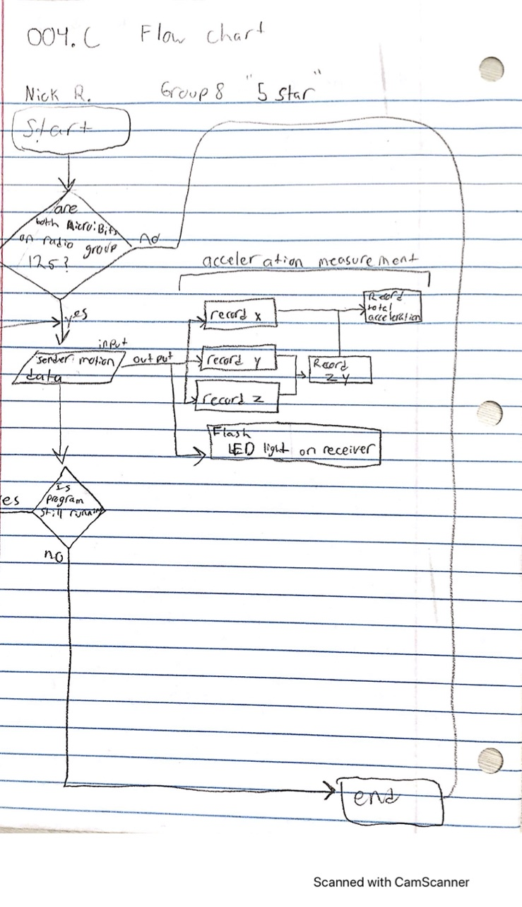

# Mission-to-Mars-Documentation 
## By: 5-Star 
##### Nick, Hayden, Vincent

## "The Starred Sensor"
This sensor has of 2 functions: An accelerometer in the X, Y, and Z dimensions, as well as a compass. The sensor consists of 2 Micro:Bits, one being the sender(which must be calibrated before use), and the receiver. The Sender will be in the case as payload, and will send the data to the receiever over a radio signal. The reciever will then, if connected to a computer or other device, graph the data which can be downloaded at any time. 

# Payload and Data example

# Overview
Our team used the divide and conquer method to complete the task. Nick developed the majority of the code using Microsoft's [MakeCode for Micro:Bits](https://makecode.microbit.org/), he used a radio system to communicate between the sender and reciever as explained in the above summary of "The Starred Sensor". Nick also provided some requirements to Vincent and Hayden for the development of the case, so it can function properly and be easily manipulated for calibrations.

Vincent and Hayden spent their time developing developing cases in [TinkerCAD](https://www.tinkercad.com/). They discovered ways to preserve as much material as possible, while still having a strong structure. They also left room for the Micro:Bit sender to be exposed for calibrations. They also provided valuable brainstorming ideas to Nick of ideas for the code.

# Reflections
The code so far is successful, and improvements could be made to limit misreadings of the data. Overall for the code, our team is happy with what we currently have. 

We have yet to have the availability to test our current case model, we also have a back up model that can be printed if our currently selected one does not come up to par. We expect a success however. **Improvements will be listed after testing.**

